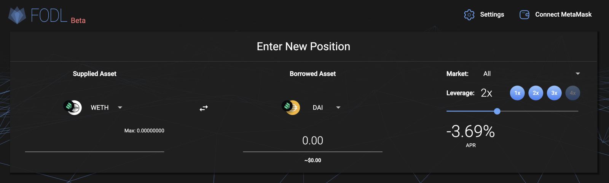
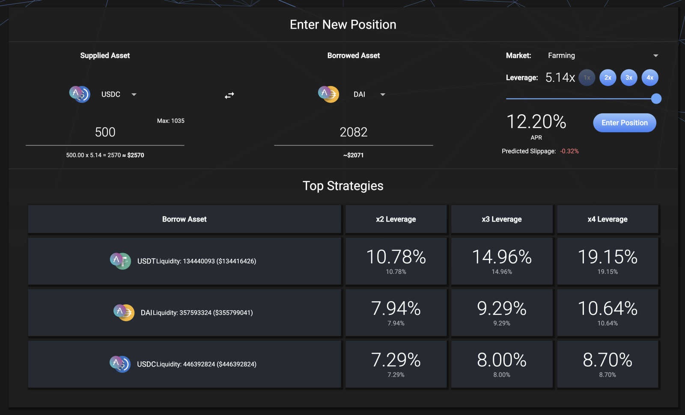
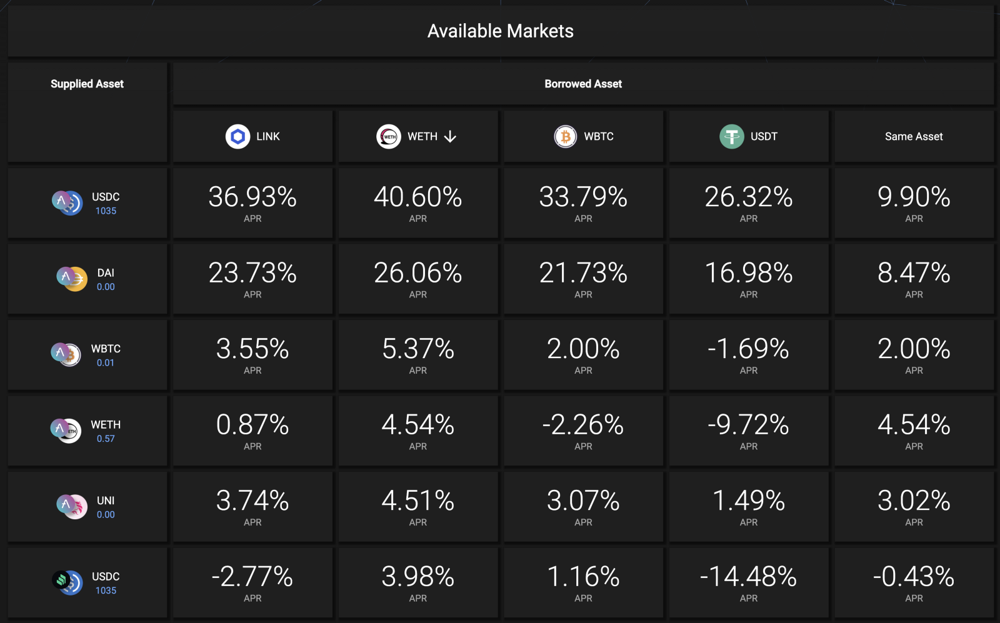

# Medium Article

.svg>)

As the team behind 0x\_b1, we spent the better part of the past year strategizing the best ways to DeFi. One of the most important things we had to solve for, was hedging our positions in ETH, WBTC, and other non-stable coins. We used a combination of centralized and decentralized trading platforms to accomplish this, and along the way were dumbfounded at how rates affected our outcomes.

Hedging is most important when the market reaches its most volatile. Consequently, when the market is most volatile you have the largest number of traders looking to hedge, resulting in a squeeze on the liquidity available to support such trading. You also pay the highest rates for the access to liquidity for leverage during such peaks in trading volatile markets.

What we found was that, whether on a CEX like Binance or a DEX like DYDX, whenever our leverage trades were the most important to our portfolio allocation strategy, they were also relatively the most expensive time to do them. During the January-April bull market, up to 30% of the profits from our leverage longs on ETH were eaten by fees. We thought to ourselves — how could we accomplish what we needed to without relying on only centralized counterparties? We weren’t looking for insanely risky leverage ratios or exotic put/call options — we just needed a transparent, low cost way to secure leverage for long and short positions we wanted to take.

Another strategy we employed was a basic form of yield folding, most popularized by InstaDapp’s 4x Maximizing of COMP rewards. We thought to ourselves: if you can 4x leverage the same asset back and forth (fold) to earn as much COMP as possible, why can’t we do the same with cross asset folds, utilizing the deep liquidity of Lending Platforms as a source of leverage for trading? Obviously cross-asset folds are much more risky and prone to liquidations if the market moved in the wrong direction, however this could easily be solved by using smart contract bot automation to manage and close positions before any such liquidations. We also need to solve the “too many swaps” problem for opening these folded leverage positions → easily solved by incorporating flash loans into smart contracts and executing it in a single atomic transaction.

With the concept fully baked, we began to manually deploy our own “fodl” trades, and the value savings were even greater than expected (largely due to the impact of leveraged interest rates and governance rewards paid by the lending platforms to our positions). We quickly came to the conclusion that folding strategies could become even cheaper the more mainstream they became by driving even deeper liquidity to the platforms we were utilizing.

#### Why Fodl

We built Fodl to meet the need for highly liquid, low-cost, and fully on-chain leverage. Rather than reinventing a centralized exchange, we looked for how we could utilize existing defi building blocks to accomplish our goals — further bolstering existing platforms with new cases. Collateralized lending platforms in combination with flash loans turned out to be a great method of using highly liquid markets to achieve decentralized leverage \[for the purpose of long & short trading].

Fodl accesses liquidity from collateral lending markets, enabling traders to utilize leverage for their trades without paying a funding rate. Rather than volatile on/off-chain funding rates driven by a smaller market of margin traders, lending platforms provide deep liquidity, low volatility interest rates and governance token rewards, allowing for a user’s position to almost always fully pay for itself. Our motto is: be your own funding rate!

The second goal with Fodl was to align the platform with the ethos of DeFi — a fully decentralized platform, revenue distribution model and user experience. With Fodl, everything is calculated and executed on-chain. Users do not send their funds to a centralized pool or protocol. Users maintain the keys to their positions, and have the option to enable stop loss and take profit bots only to unwrap their positions. All revenue from the protocol is utilized to buyback the protocol’s token from decentralized liquidity pools, meaning no revenue will ever be sent to a team wallet or central party.

As the FODL supply becomes more and more distributed amongst the community to the users of the platform and liquidity providers, we’re looking toward a DAO community with full control over the platform, and access to 100% of protocol revenue via FODL-ETH and FODL-USDC LPs. Over time, the team behind Fodl plans to further decentralize the platform, along with its development, upkeep, and running of stop loss/take profit and liquidation bots. Using the 10% of FODL supply allocated for development grants, and combined with the DAO, the project will seek to fund a community of developers and strategists around the platform, to completely decentralize the project.

Look out for more details on the launch of the Fodl platform coming very, very soon! The only ways to get FODL tokens are through opening positions on the platform, or by buying FODL out of the launch liquidity pools FODL-ETH or FODL-USDC.

The team has committed to funding the initial liquidity pools with 20% of the total Fodl supply against $5m, split evenly between ETH and USDC, which sets the FDV of the protocol at $25M. Happy trading!
